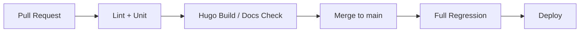

+++
title = "ML 저장소에서 CI 신뢰도를 높이는 현실적인 방법"
date = 2026-02-19T11:00:00+09:00
tags = ["ci", "mlops", "engineering"]
categories = ["posts", "devops"]
summary = "테스트 시간이 긴 ML 코드베이스에서 CI 파이프라인을 느리게 만들지 않으면서 실패 신호를 유지하는 방법을 정리한다."
draft = false
toc = true
description = "ML 코드베이스 CI 신뢰도 개선을 위한 실무 체크리스트"
+++

## 문제 배경

ML 저장소는 데이터 의존성과 실험 코드가 섞여 있어 CI가 느려지기 쉽다. 파이프라인이 느려지면 개발자가 CI 결과를 신뢰하지 않게 되고, 결국 main 브랜치 품질이 흔들린다.

## 내가 적용한 기본 원칙

1. `PR` 단계는 빠른 실패 감지에 집중한다.
2. 무거운 통합 검증은 `main` 병합 후로 이동한다.
3. 테스트 안정성이 낮은 항목은 quarantine 하되, 원인 추적 티켓을 반드시 남긴다.

## 최소 구조 예시



## 체크 스크립트 예시

```bash
set -euo pipefail
python3 scripts/validate_front_matter.py
python3 scripts/check_internal_links.py
hugo --gc --minify
```

## 결론

CI 품질의 핵심은 툴 선택보다 단계 분리다. 빠른 피드백 경로와 느린 검증 경로를 분리하면 개발 속도와 안정성을 동시에 가져갈 수 있다.
